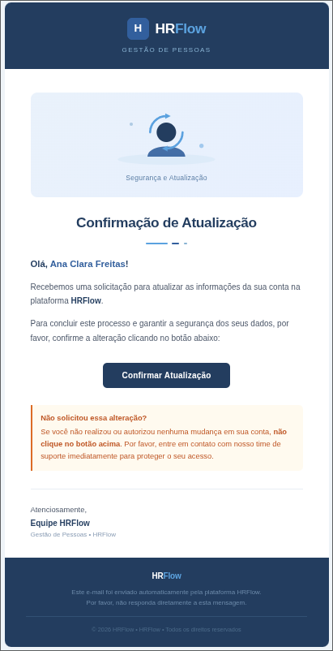
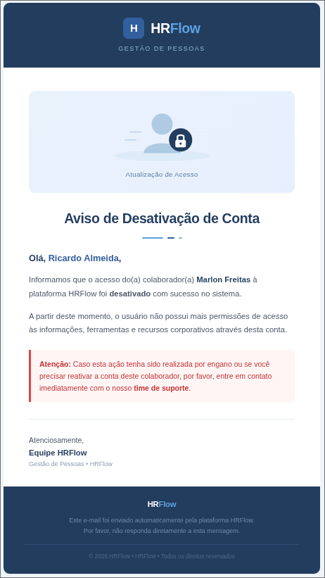

<div align="center">

# 🏢 HRFlow Gestão de Pessoas

<!-- Badges Core & Security -->


<!-- Badges Data, Mail & Mapping -->


<!-- Badges Architecture & Tests -->


---

O **HRFlow Gestão de Pessoas** é uma API RESTful desenvolvida para o gerenciamento eficiente do ciclo de vida de colaboradores dentro de uma organização. O sistema permite o cadastro, atualização e inativação (soft delete) de funcionários, além de estruturar a hierarquia corporativa através de um auto-relacionamento com gestores, garantindo a segurança de todos os endpoints com autenticação JWT.

O grande diferencial técnico desta aplicação é a sua arquitetura orientada a eventos (*Spring Events*) aliada ao processamento assíncrono (`@Async`). Ações importantes disparam o envio automático de e-mails em background, utilizando templates HTML dinâmicos renderizados com *Thymeleaf*. Essa abordagem desacopla a regra de negócio e garante que a latência de servidores SMTP não trave o tempo de resposta da API.

</div>

<br>
---

## 🛠️ Tecnologias e Stacks Utilizadas

* **Java 17 & Spring Boot 3:** Base moderna e performática do projeto.
* **Spring Security & JWT (Bearer Token):** Autenticação robusta para proteção das rotas.
* **Spring Events & `@Async`:** Desacoplamento de regras de negócio para disparos de e-mail assíncronos, sem bloquear a Thread principal.
* **JavaMailSender & Mailtrap.io:** Serviço de envio de e-mails, utilizando o Mailtrap para captura e testes seguros em ambiente de desenvolvimento.
* **Thymeleaf:** Motor de templates para renderização dinâmica de páginas HTML para o corpo dos e-mails.
* **Spring Data JPA & PostgreSQL:** Persistência de dados.
* **Flyway Migrations:** Versionamento do banco de dados, incluindo scripts de carga inicial com dados de teste (`V4__insert_dados_teste.sql`).
* **MapStruct & Lombok:** Mapeamento eficiente de Entidades para DTOs e redução drástica de *boilerplate code*.
* **JUnit 5 & Mockito:** Testes unitários focados na camada de serviço para garantir a integridade das regras de negócio (Padrão AAA).

---

## 🏗️ Arquitetura Orientada a Domínio (DDD)

A API foi desenhada utilizando conceitos de **Domain-Driven Design (DDD)**, garantindo um código altamente coeso e de baixo acoplamento:

* **Domain:** Entidades de negócio (`Colaborador`, `Notificacao`), Enums (`TipoNotificacao`, `StatusEnvio`) e regras puras.
* **Application:** Serviços de orquestração (`ColaboradorService`), que disparam os *Events* (`ColaboradorCriadoEvent`, etc) sem se importar com a infraestrutura de e-mail.
* **Infrastructure:** Repositórios, Listeners assíncronos (`EmailListener`), serviço real de e-mail (`EmailService`) e as configurações de segurança (Filtros JWT).
* **Web:** Controllers (`ColaboradorController`) e DTOs, e o **Gerenciador Global de Exceções** (`@RestControllerAdvice`), que padroniza todos os retornos de erro da API em formatos consistentes (`ProblemDetail` ou respostas customizadas).

---

## 📧 Templates Dinâmicos de E-mail (Thymeleaf)

A aplicação possui 3 templates HTML desenhados especificamente para a comunicação corporativa:

1. **Boas-vindas:** Disparado quando a conta do colaborador é criada.
2. **Atualização Cadastral:** Disparado ao próprio colaborador quando seus dados são alterados.
3. **Notificação de Inativação:** Disparado **exclusivamente para o Gestor** imediato do colaborador quando este é desligado da empresa (Soft Delete).

### 📸 Prints dos E-mails
<div align="center">

|                  Boas-vindas                   |                      Atualização de Dados                       |                      Notificação ao Gestor                      |
|:----------------------------------------------:|:---------------------------------------------------------------:|:---------------------------------------------------------------:|
|  | ** | ** |

</div>

---

## ▶️ Como Executar o Projeto

### 1. Pré-requisitos
* Java 17 instalado
* PostgreSQL rodando na porta 5432
* Um provedor de e-mail

### 2. Clonar o repositório
```bash
git clone https://github.com/brunoverly/api-HRflow.git
cd api-HRflow
```

### 3. Configurar Variáveis de Ambiente
O projeto utiliza a separação de *properties* (`application.properties` e `application-dev.properties`). Renomeie ou crie/edite o arquivo `application-dev.properties` em `src/main/resources/` com os seus dados locais:

```properties
# Configuração do Banco de Dados PostgreSQL
spring.datasource.url=jdbc:postgresql://localhost:5432/hrflow_db
spring.datasource.username=seu_usuario_aqui
spring.datasource.password=sua_senha_aqui

# Credenciais de e-mail (SMTP)
spring.mail.host=smtp.gmail.com
spring.mail.port=587
spring.mail.username=seu_email@gmail.com
spring.mail.password=sua_app_password

spring.mail.properties.mail.smtp.auth=true
spring.mail.properties.mail.smtp.starttls.enable=true

# Chave Secreta JWT
api.security.token.secret=sua_chave_secreta_jwt_super_segura
```

### 4. Criar o Banco de Dados
Crie um banco de dados vazio no seu PostgreSQL com o nome `hrflow_db`. O **Flyway** se encarregará de criar todas as tabelas e inserir os dados de teste assim que a aplicação iniciar.

### 5. Executar a Aplicação
Pelo terminal na raiz do projeto, execute:
```bash
mvn spring-boot:run
```
A API estará disponível em `http://localhost:8080`.

---
<div align="center">
  Desenvolvido com ☕ e muito código por <b>brunoverly</b>.
</div>